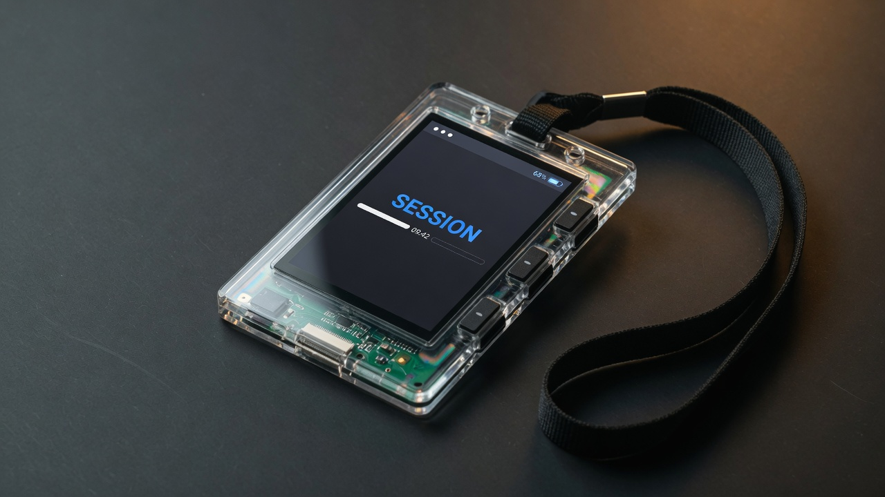
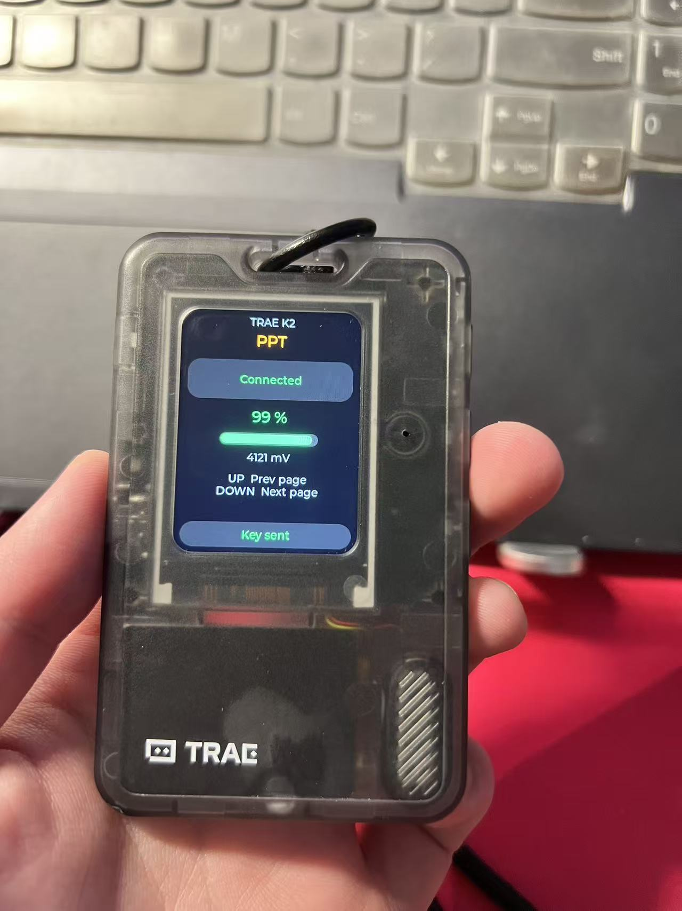
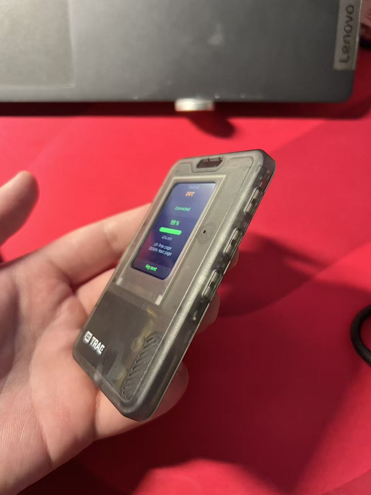
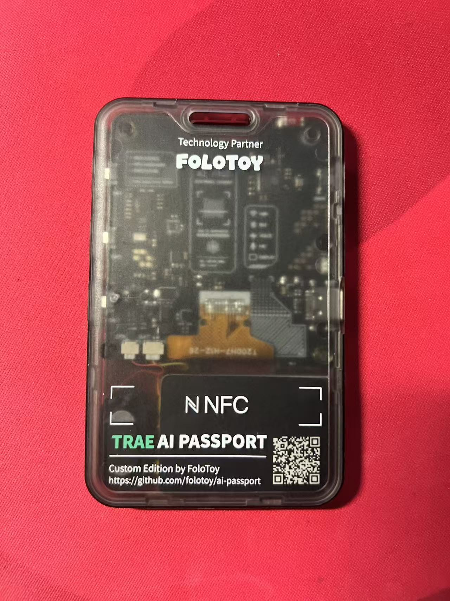
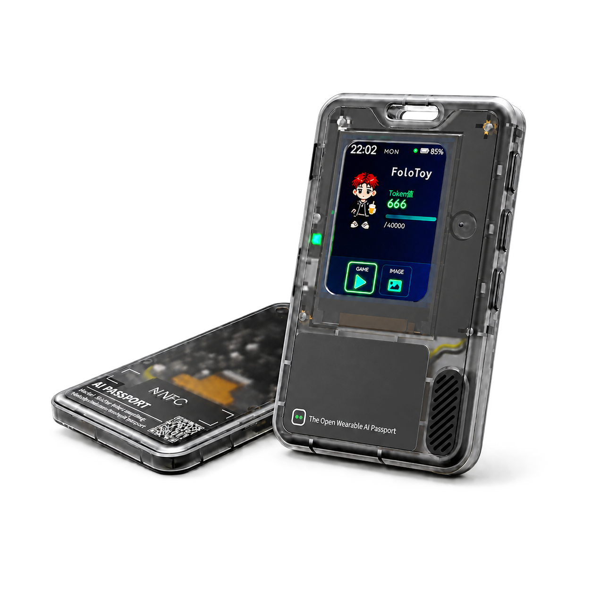
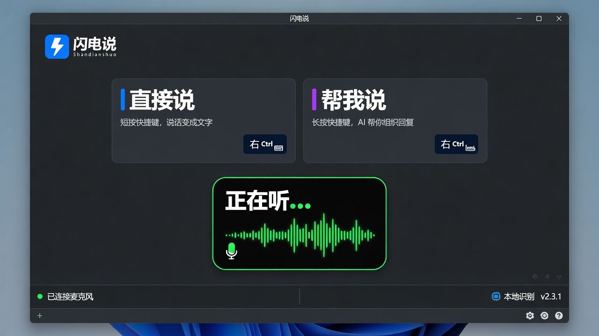
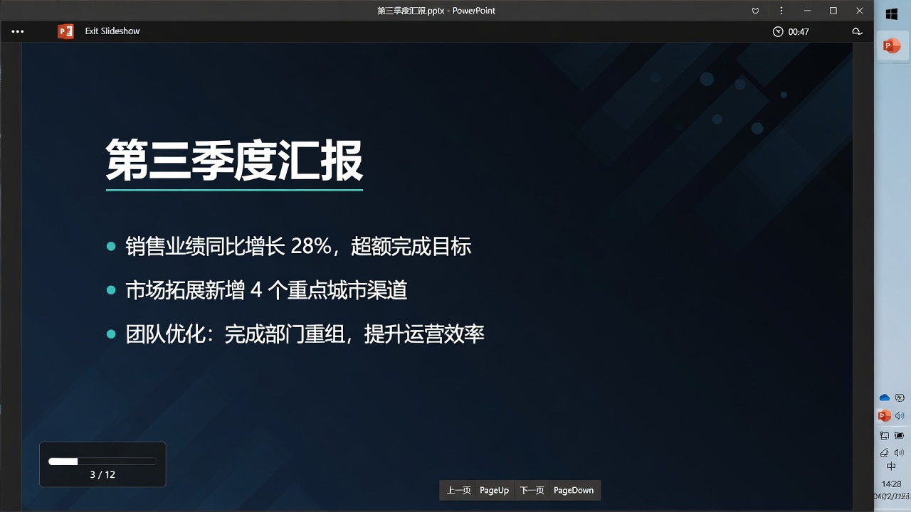

# TRAE K2

一块大赛通行证，变成口袋里的 **闪电说 / PPT 遥控器**。

不需要电脑伴侣脚本，不需要云，不需要 App。工牌自己就是一块 Windows 蓝牙键盘。

<p>
  
</p>

真机照片（这块 TRAE 工牌，已刷 TRAE K2）：

| 正面 | 右侧三键 | 背面 |
|---|---|---|
|  |  |  |

对照 FoloToy 官网棚拍（出厂名片界面，不是本固件）：

<p>
  
</p>

工牌遥控的两个软件：

| 闪电说 | PowerPoint |
|---|---|
|  |  |

| 键 | 作用 |
|---|---|
| **上** | 当前档的「上」 |
| **下** | 当前档的「下」 |
| **确认 短按** | 换挡，屏幕立刻改名字 |
| **确认 长按** | 回 BSP 菜单 |

| 档位（屏顶名字） | 上键 | 下键 |
|---|---|---|
| **Shandian** 蓝字（默认） | Right Ctrl · 闪电说开始/结束 | Enter |
| **PPT** 橙字 | PageUp · 上一页 | PageDown · 下一页 |

蓝牙名：**TRAE K2**。配对一次后，关机再开会自己连回来。

---

## 你是谁，读哪份

| 角色 | 从这里开始 |
|---|---|
| 手里刚拿到工牌，只想烧进去用 | [docs/from-zero.md](docs/from-zero.md) |
| 要给现场做演示 / 拍视频 | [docs/video-script.md](docs/video-script.md) · [deck/TRAE-K2-real.pptx](deck/TRAE-K2-real.pptx) |
| 要改固件、加第三档 | [docs/architecture.md](docs/architecture.md) · [docs/extend-modes.md](docs/extend-modes.md) |
| **Agent / 编码助手，从零接管这块板** | **[AGENTS.md](AGENTS.md)** |

CONTEXT（为什么这样设计，哪些路走过是错的）：[CONTEXT.md](CONTEXT.md)

---

## 30 秒理解

这是 FoloToy **TRAE AI Passport**（大赛门票电子工牌，ESP32-C3 + 彩屏 + 三键）。

出厂固件是 TRAE 主题名片。本仓库把它换成自定义固件：

1. 工牌用 BLE HID 冒充键盘
2. 闪电说吃的是 **真正的 HID 右 Ctrl**，不是脚本模拟按键
3. 确认键是档位杆，不是「确定」

所以：打开闪电说 → 按上键开始说 → 再按上键结束。切到 PPT 档就能翻页。

---

## 烧录（已有预编译固件）

> **先备份出厂 Flash。** 本仓库 **不含** 出厂镜像。每块工牌的 NVS / 卡号 / 云密钥都不一样。刷自定义固件会盖掉门票界面。备份方法见 [docs/from-zero.md](docs/from-zero.md)。

Windows，工牌用 USB-C 插上：

```bat
pip install esptool pyserial
python scripts\flash.py
```

脚本会按 USB **VID `303A` PID `1001`** 自动找口，写入：

| 地址 | 文件 |
|---|---|
| `0x0` | `release/bootloader.bin` |
| `0x8000` | `release/partition-table.bin` |
| `0x10000` | `release/FoloToy-AI-Passport.bin` |

**不会擦 NVS。** 配对成功后不要 `erase_flash`。

---

## 配对 Windows

1. 设置 → 蓝牙和设备 → **添加设备**（不要只点任务栏弹出层，它经常停在 Connecting）
2. 选 **TRAE K2**
3. Just Works，没有 PIN。网页上的 `k=……` 是官方设备 KEY，**不是** Windows 配对码
4. 屏上变成 `Connected` 之后，上/下键才会出 HID

详细： [docs/windows.md](docs/windows.md)

---

## 从源码编译

- 芯片：ESP32-C3，8MB Flash，**无 PSRAM**
- 框架：ESP-IDF **5.5.3**
- 组件源（国内）：`https://components-file.espressif.cn`（已写在 `idf_component_manager.yml`）

```bat
cd firmware\ai-passport
idf.py set-target esp32c3
idf.py build
python ..\..\scripts\flash.py --from-build
```

---

## 仓库地图

```
trae-k2-remote/
  AGENTS.md                 Agent 从零操作手册（先读这个）
  CONTEXT.md                产品决策与踩坑
  docs/                     给人看的分章
  firmware/ai-passport/     ESP-IDF 工程
  release/                  可直接烧的 bin
  scripts/                  找口、备份、烧录
  deck/TRAE-K2.pptx         介绍视频用幻灯片
```

关键源码：

| 文件 | 职责 |
|---|---|
| `main/ble_hid_kbd.c` | HID 报告、档位、上/下键键码 |
| `main/demo_talk.c` | 屏：模式名、电量、连接状态 |
| `main/main.c` | 上/下键走 HID（不加 LVGL 锁）；长按确认回菜单 |
| `main/esp_hid_gap.c` | NimBLE 广播名 TRAE K2、Just Works、绑定 |
| `components/bsp/include/bsp_pins.h` | 引脚与按键 ADC 窗口的唯一事实来源 |

---

## 声明

- 硬件来自 [FoloToy/ai-passport](https://github.com/FoloToy/ai-passport)。本仓库是社区自定义固件，**不是** TRAE / FoloToy 官方产品。
- 刷机前请自己备份整片 Flash。出厂门票界面、头像、云端三元组不在本仓库里。
- 闪电说是第三方 Windows 软件；本固件只发送标准键盘 HID。
